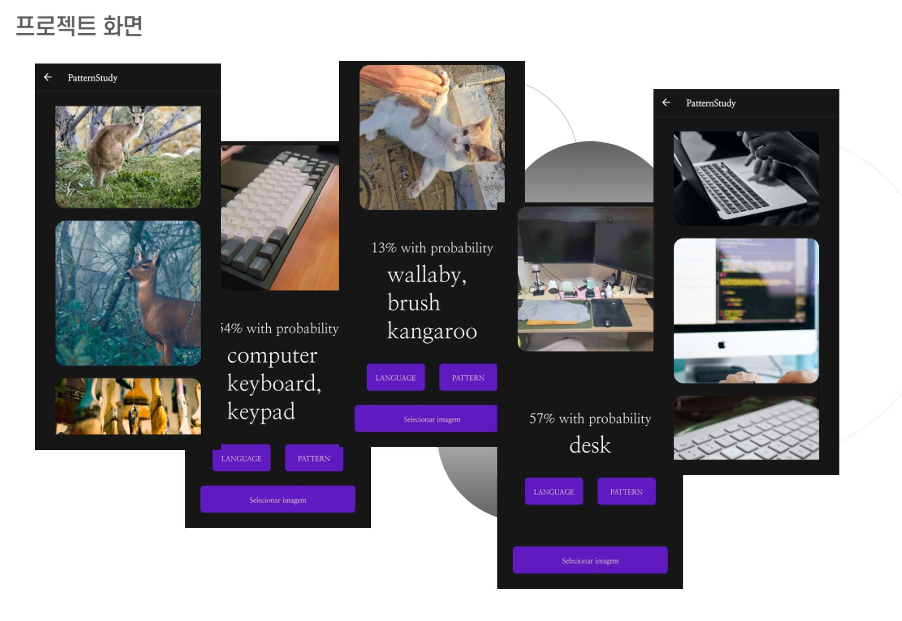

# barcode Project

### 인공지능 기반 어린이 영단어 사물 패턴 학습 서비스
## [What Is This Teacher]
>현재 어린이들의 IT기기를 통한 미디어 이                    용률을 보면 많은 시간을 IT기기와 함께 지내고 있다는 것을 알 수 있다. 이를 이용하여 단순 오락만을 노출 시키는 것이 아닌 아이들의 통합적 사고 능력 향상을 야기하는 컨텐츠를 제공함으로써 보다 학습적인 방향으로 IT기기를 사용하게 한다.
>이에 IT기기 서비스로 아이들을 효과적으로 사고능력을 향상시키고자 한다.

-----------------------------------------------

<h3>GIF 미리보기</h3>
</img> 
     

<h3>barcoder 미리보기</h3>
<!-- </img> -->
</img>  

     

<h3>Barcoder 흐름도</h3>
</img>  

 

## WhatIsThisTeacher 사용법
> 사용전 준비물 <VSCode, NodeJs, expo, react-Native >
1. 프로젝트를 클론 및 다운로드합니다.
2. 핸드폰에 Expo Go 어플을 다운로드해준다.
3. vsCode, NodeJs, Expo, react-native 를 준비해준다.
4. 터미널에 폴더 찾아가서 npm install로 프로젝트 모듈을 다운로드한다.
5. npx expo start -c 를 통해서 실행시켜준다.
6. 큐알코드를 핸드폰으로 스캔해준다.

  
  

프로젝트의 필요성
---
- 누군가에게 질문해 쉽게 알아내는 것이 아닌, 인공지능을 이용해 스스로 단어를 학습해 더욱 오래 기억할 수 있다.

 - 비슷한 사진의 예시를 보면서 그 사물의 특징을 스스로 구분하고 패턴을 파악할 수 있다.

 - 표시된 키워드를 통해 papago로 번역된 단어의 뜻을 알 수 있다.

 - 부모와 아이에게 IT기기에 대한 유흥 뿐 아닌 학습으로부터의 긍정적인 인식을 불러일으킬 수 있다.

 - 변화하는 시대에 맞춰 아이들이 IT기기와 인공지능에 친근해지는 계기가 될 수 있다.
